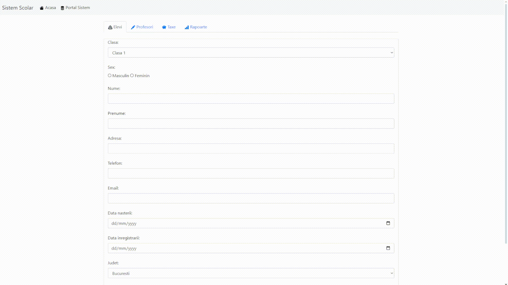

# Sistem Şcolar
**Această aplicație este destinată gestionării informațiilor referitoare la elevi și profesori din municipiul București și județul Ilfov. De asemenea, facilitează vizualizarea datelor și statisticilor într-un mod simplu și eficient, oferind utilizatorilor o experiență intuitivă și accesibilă în administrarea datelor.**

## Funcţionalităţi
- Adăugare/Actualizare date personale elevi/profesori
- Adăugare/Actualizare medii elevi
- Vizualizare în grafic a burselor de merit acordate în sectoarele municipiului Bucureşti
- Actualizare în timp real a rapoartelor cu privire la mediile şcolare din Bucureşti şi Ilfov

## Tehnologii utilizate
**Frontend**

**Backend**

## Cerinţe
Pentru o funcţionare optimă, proiectul necesită următoarele:
- PHP 5.6+
- Extensia `pdo_sqlite` activată in fişierul `php.ini`

## Instalare
Pentru instalarea locală a proiectului, utilizează comanda:
- `git clone https://github.com/vlaadutz/SistemScolar`

## Licenţă
Acest proiect este licenţiat sub Licenţa AGPL-3.0 - vezi fişierul LICENSE pentru mai multe informaţii.
